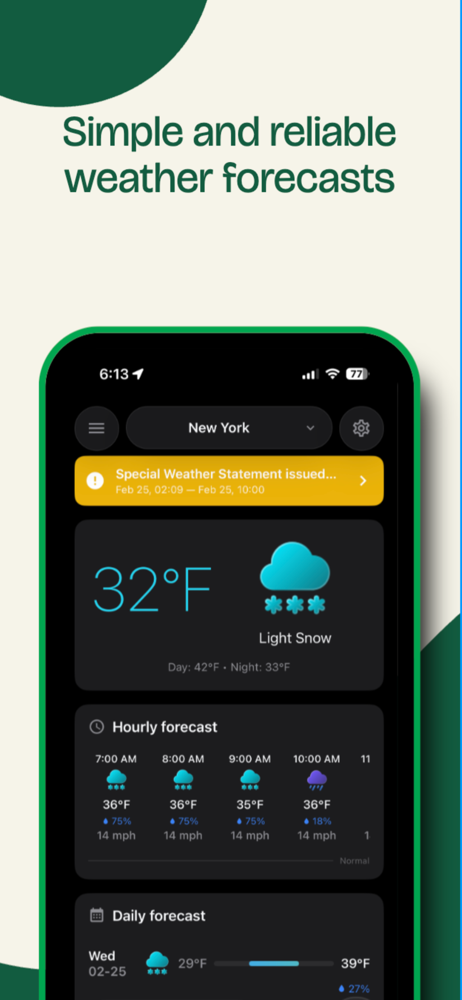
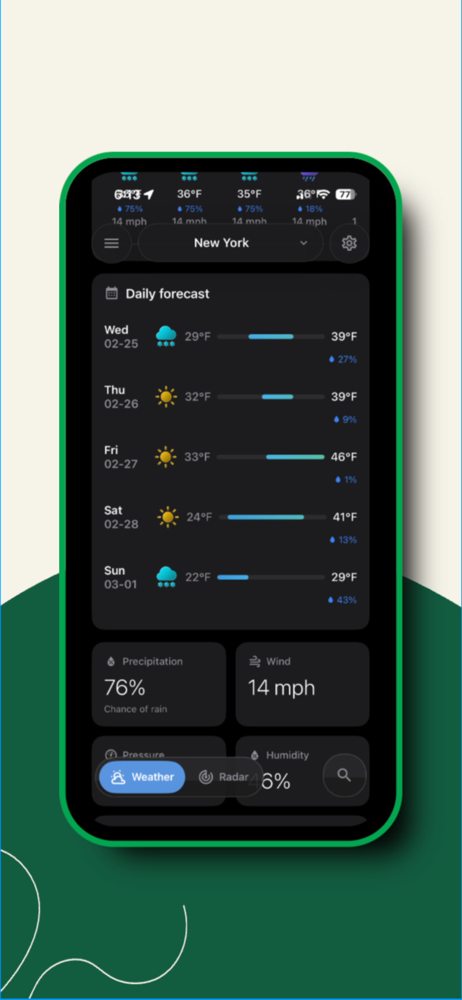
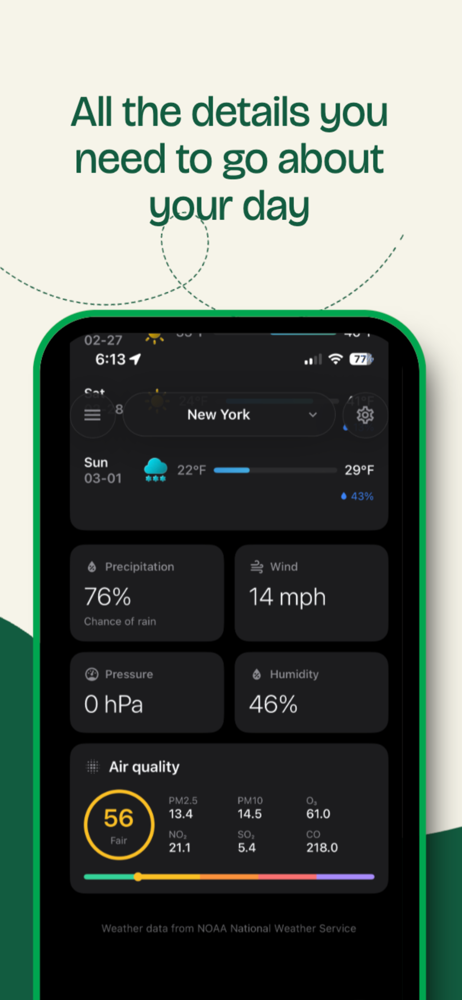
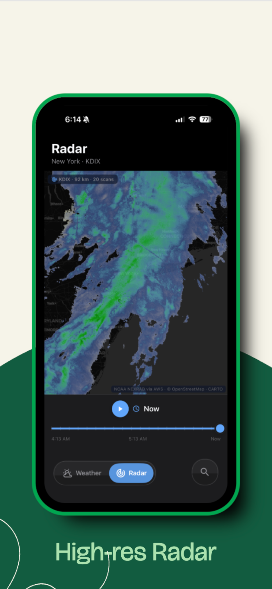

# Zephyr Weather

A beautifully simple weather app you can rely on!

Inspired by [Breezy Weather](https://github.com/breezy-weather/breezy-weather).


## Screenshots

<p align="center">
  
  
  
  
</p>

## Features

### Platforms
- **iOS**: iPhone and iPad support (iOS 16.4+)
- **macOS**: Full Mac Catalyst support with native macOS widgets (macOS 13.0+)
  - Two-column layout with sidebar and detail view
  - Optimized for desktop mouse/trackpad navigation
  - Native macOS window management
- **Widgets**: iOS Home Screen and macOS Notification Center widgets

### Weather Data
- **Current Conditions**: Temperature, feels like, weather description, and live updates
- **Hourly Forecast**: 24-hour temperature and precipitation forecast with interactive scroll
- **Daily Forecast**: 7-day extended forecast with high/low temperatures
- **Weather Alerts**: Severe weather warnings with severity levels
- **Air Quality Index**: Real-time AQI with component breakdown (PM2.5, PM10, O3, NO2, SO2, CO)
- **Pollen Levels**: Grass, tree, ragweed, and mold counts
- **UV Index**: Daily UV levels with risk assessment

### Weather Details
- **Wind**: Speed, gusts, and direction
- **Precipitation**: Probability, total amount, and type
- **Humidity**: Relative humidity and dew point
- **Pressure**: Atmospheric pressure
- **Visibility**: Current visibility distance
- **Sun & Moon**: Sunrise, sunset, moonrise, moonset, and moon phase

### Locations
- **Multiple Locations**: Save and manage multiple locations
- **Current Location**: Automatic GPS-based weather
- **Location Search**: Search cities worldwide using Open-Meteo geocoding

### Customization
- **Theme**: Light, dark, or system automatic
- **Units**: 
  - Temperature: Celsius / Fahrenheit
  - Wind: km/h / mph / m/s / knots
  - Pressure: hPa / inHg / mmHg
  - Precipitation: mm / inches
  - Distance: km / miles

### Widgets (iOS & macOS)
- **Current Weather Widget**: Small, medium, large, and extra-large sizes
  - Temperature with color-coded display
  - Weather condition icon and text
  - High/low temperatures
  - Additional details (humidity, wind, feels-like) in large size
- **Daily Forecast Widget**: Medium, large, and extra-large sizes
  - 4-7 day forecast with temperature bars
  - Precipitation probability indicators
  - Visual temperature range representation
- **Lock Screen Widgets**: Inline, circular, and rectangular complications
  - Current conditions (Current Weather widget)
  - 3-day outlook (Daily Forecast widget)
- **StandBy**: Home Screen widget sizes work in iPhone StandBy automatically
- **Live Activity**: Current conditions on the Lock Screen and Dynamic Island
  - Local-only (no push server), refreshes with each forecast update
  - Toggle in Settings → Lock Screen
- **Widget Configuration**: Select any saved location
- **Auto-refresh**: Updates every 15-30 minutes
- **App Group Sharing**: Unified data between app and widgets

## Weather Sources

Currently integrated with **[The National Weather Service (NWS) API](https://www.weather.gov/documentation/services-web-api)** for US weather, and **[Open-Meteo](https://open-meteo.com/)** for global forecasts. Additional sources (MET Norway, Bright Sky, NEXRAD radar, and a multi-source ensemble) are wired through the services layer.

### Open-Meteo Features
- Weather forecast
- Current conditions
- Air quality data
- Pollen data
- Geocoding search
- No API key required

## Architecture

```
src/
├── App.tsx                     # Root component
├── types/
│   ├── weather.ts              # Weather data types
│   └── settings.ts             # Settings types
├── store/
│   └── weatherStore.ts         # Zustand state management
├── services/
│   ├── preferredWeatherService.ts # Source dispatcher (US → NWS, else Open-Meteo)
│   ├── openMeteoService.ts     # Open-Meteo API integration
│   ├── nwsService.ts           # National Weather Service API
│   ├── metnoService.ts         # MET Norway API
│   ├── brightSkyService.ts     # Bright Sky API
│   ├── nexradService.ts        # NEXRAD radar
│   ├── ensembleService.ts      # Multi-source ensemble
│   └── weatherCache.ts         # Response caching
├── navigation/
│   └── RootNavigator.tsx       # React Navigation setup
├── screens/
│   ├── HomeScreen.tsx          # Main weather display
│   ├── MacOSHomeScreen.tsx     # macOS two-column layout
│   ├── RadarScreen.tsx         # Radar view
│   ├── LocationsScreen.tsx     # Location management
│   ├── SettingsScreen.tsx      # App settings
│   ├── SearchLocationScreen.tsx # Location search
│   ├── DailyDetailScreen.tsx   # Detailed daily view
│   └── AlertsScreen.tsx        # Weather alerts
├── components/
│   ├── GlassSurface.tsx        # Glassmorphism design-system base
│   ├── CurrentWeatherCard.tsx  # Current conditions
│   ├── HourlyForecastCard.tsx  # Hourly scroll view
│   ├── DailyForecastCard.tsx   # Daily forecast list
│   ├── WeatherDetailCard.tsx   # Wind, humidity, etc.
│   ├── AirQualityCard.tsx      # AQI display
│   └── AlertBanner.tsx         # Alert notification
├── hooks/                      # useThemeColors, useWeatherRefresh, formatters…
├── utils/
│   ├── widgetManager.ts        # App Group sync + WidgetKit reloads
│   └── formatting.ts           # Unit formatting
└── theme/
    ├── design.ts               # Design tokens & glass styles
    └── colors.ts               # Color system
```

## Getting Started

### Prerequisites

- Node.js 18+
- Xcode 14+ (for iOS/macOS development)
- CocoaPods

### Installation

1. Clone the repository:
```bash
git clone https://github.com/ghobs91/zephyr-weather.git
cd zephyr-weather
```

2. Install dependencies:
```bash
npm install
```

3. Install iOS/macOS pods (or run `npm run pod-install`):
```bash
cd ios && pod install && cd ..
```

4. Start the Metro bundler:
```bash
npm start
```

5. Build and run:

**iOS:**
```bash
npm run ios
```

**macOS (Catalyst):**
```bash
npx react-native run-ios --scheme ZephyrWeather --destination "platform=macOS,variant=Mac Catalyst"
```

Or open `ios/ZephyrWeather.xcworkspace` in Xcode and select "My Mac (Designed for iPad)" as the destination.

For detailed macOS setup instructions, see [MACOS_SETUP.md](MACOS_SETUP.md).

## Build & Release

- **EAS Build**: `eas build --profile production` (App Store) or `--profile development` (internal dev client); configuration in `eas.json`.
- **Xcode Cloud**: builds run through `ios/ci_scripts/ci_post_clone.sh` (installs Node, npm dependencies, pods, and generates Expo module stubs).
- **Fastlane**: `cd ios && bundle exec fastlane beta` uploads to TestFlight; `fastlane release` builds and uploads for App Store review.
- **Versioning**: version and build number live in `app.json`; Fastlane bumps build numbers per upload.

## Dependencies

### Core
- `expo` - Expo SDK 57 (build tooling and native module autolinking)
- `react-native` - Cross-platform mobile framework
- `typescript` - Type safety

### State Management
- `zustand` - Lightweight state management
- `@react-native-async-storage/async-storage` - Persistent storage

### Navigation
- `@react-navigation/native` - Navigation container
- `@react-navigation/native-stack` - Native stack navigator
- `@react-navigation/bottom-tabs` - Tab navigation

### UI
- `react-native-vector-icons` - Icon library
- `react-native-safe-area-context` - Safe area handling
- `react-native-screens` - Native navigation screens
- `react-native-linear-gradient` - Gradient backgrounds
- `react-native-haptic-feedback` - Haptic feedback

### Utilities
- `date-fns` - Date formatting
- `axios` - HTTP client

### Location
- `@react-native-community/geolocation` - GPS access

## Roadmap

- [x] Widget support (iOS & macOS)
- [x] macOS Catalyst app
- [ ] Apple Watch companion app
- [ ] Additional weather sources (NWS, MET Norway, etc.)
- [ ] Weather maps (radar, satellite)
- [ ] Interactive charts
- [ ] Background refresh
- [ ] Siri shortcuts
- [ ] iPad-optimized layout

## Credits

- Inspired by [Breezy Weather](https://github.com/breezy-weather/breezy-weather)
- Weather data by [Open-Meteo](https://open-meteo.com/) (CC BY 4.0)
- Icons by [Material Community Icons](https://materialdesignicons.com/)

## License

MIT License - see [LICENSE](LICENSE) for details.
