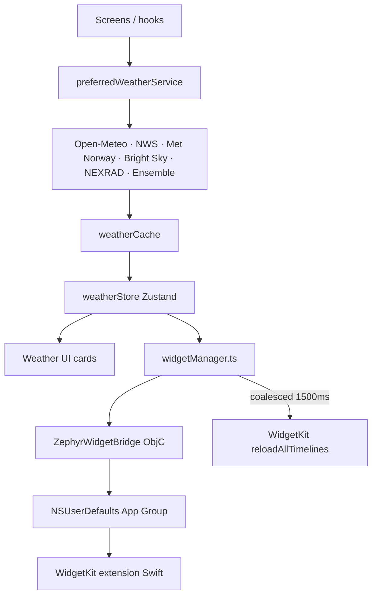

# Zephyr Weather — Architecture

## System overview

Zephyr Weather is a client-only weather app: a React Native application running on iOS and macOS (Mac Catalyst), plus a native WidgetKit extension for Home Screen (iOS) and Notification Center (macOS) widgets. There is no backend and no user accounts — all weather data is fetched on-device from public, keyless weather APIs. The RN app shares weather data with the widgets one-way through a shared App Group (UserDefaults), bridged by an Objective-C native module.

## Major components

1. **React Native app** (`src/`) — screens, navigation, theming, and state management.
2. **Weather services** (`src/services/`) — per-provider fetchers (Open-Meteo, NWS, Met Norway, Bright Sky, NEXRAD, ensemble) behind a `preferredWeatherService` dispatcher and a `weatherCache`.
3. **Widget bridge** — `src/utils/widgetManager.ts` → `ZephyrWidgetBridge` (ObjC RCT module) → `NSUserDefaults` in the App Group → WidgetKit reload.
4. **Widgets** (`ios/ZephyrWeatherWidgets/`) — Swift WidgetKit views that read the App Group; reloads are triggered from native code via `ZephyrReloadAllWidgets()` (exposed with `@_cdecl` to avoid ObjC/Swift header generation ordering issues).

## Directory map

```
index.js                    # RN entry point — registers src/App with an error boundary
src/
  App.tsx                   # root: theme, NavigationContainer, RootNavigator
  navigation/RootNavigator.tsx
  screens/                  # HomeScreen, MacOSHomeScreen (Catalyst), RadarScreen, DailyDetailScreen,
                            #  AlertsScreen, LocationsScreen, SearchLocationScreen, SettingsScreen
  components/               # weather cards + GlassSurface design-system primitives
  store/weatherStore.ts     # Zustand store
  services/                 # openMeteoService, nwsService, metnoService, brightSkyService,
                            #  nexradService, ensembleService, preferredWeatherService, weatherCache
  hooks/                    # useThemeColors, useWeatherRefresh, useWeatherFormatters, etc.
  theme/design.ts           # getThemeColors, withAlpha, glass/card/pill styles
  theme/colors.ts           # color palettes
  utils/                    # widgetManager, formatting, timeFormat, sunCalc, weatherIcons, platformDetect
  types/                    # weather.ts, settings.ts
ios/
  ZephyrWeather/            # app target (Objective-C bridge: ZephyrWidgetBridge.m)
  ZephyrWeatherWidgets/     # WidgetKit extension (Swift)
  Podfile                   # Expo autolinking, static frameworks, fmt header patch
  ci_scripts/ci_post_clone.sh  # Xcode Cloud build script
fastlane/                   # Fastfile lanes: beta (TestFlight), release (App Store)
```

## Entry points

- **JS**: `index.js` → `AppRegistry.registerComponent(appName)` → `src/App.tsx` → `RootNavigator`.
- **Native app target**: `ios/ZephyrWeather/` (expo autolinking via the Podfile).
- **Widget extension**: `ios/ZephyrWeatherWidgets/` (WidgetKit, Swift).

## Navigation

- Root native stack: `MainTabs`, `DailyDetail`, `SearchLocation`, `Alerts`, `Locations`, `Settings` (`src/navigation/RootNavigator.tsx`).
- Bottom tabs: `Home` and `Radar` with a custom glass pill tab bar.
- On macOS, the `MainTabs` route renders `MacOSHomeScreen` (two-column sidebar + detail layout) instead of the tab navigator; `SearchLocation` presents as a form sheet.

## Data flow



1. **Weather fetch**: screens/hooks call `preferredWeatherService.fetchPreferredWeather`, which dispatches to the appropriate provider (NWS for US coordinates, Open-Meteo otherwise) and merges extra sources (e.g. minutely precipitation). Results pass through `weatherCache` and land in the Zustand store.
2. **Widget sync**: store mutations (locations, weather, settings) call into `widgetManager.ts`, which serializes to JSON and writes it to the App Group via `ZephyrWidgetBridge.setItem`. Widget reloads are coalesced: the first update reloads immediately, follow-up writes within 1500 ms are batched into a single trailing reload to respect the WidgetKit reload budget.
3. **Widget read**: the Swift extension reads `weatherData` and `locations` from the App Group and renders timelines.

## State management & persistence

- **App state**: Zustand (`src/store/weatherStore.ts`) — locations, current location index, settings, loading/error state, last refresh.
- **Persistence**: `zustand/persist` middleware with AsyncStorage. Weather payloads are runtime state and are stripped on serialize; locations and settings persist.
- **Widget state**: App Group `group.com.zephyrweather.shared` — keys `weatherData` and `locations`. A widget-side cache key (`@zephyr_widget_weather_cache`) exists in AsyncStorage for restoring widget data on cold start.

## External service integrations

| Service    | Purpose                                                        | Auth |
| ---------- | -------------------------------------------------------------- | ---- |
| Open-Meteo | Forecast, current conditions, AQI, pollen, geocoding (primary) | none |
| NWS (US)   | US forecasts and weather alerts                                | none |
| Met Norway | Nordic/global forecasts                                        | none |
| Bright Sky | DWD-based forecasts                                            | none |
| NEXRAD     | US radar imagery                                               | none |
| Ensemble   | Multi-source aggregation                                       | none |

## Authentication & authorization

None. The app has no accounts and no server-side session.

## Background jobs, queues, scheduled tasks

- WidgetKit timelines are the only scheduled work; they are refreshed on-demand from the app via the bridge. No background fetch or push notification infrastructure was found in the repository (the README lists notifications as features, but only settings toggles exist in code).

## Observability & error handling

- JS: console logging via Metro; `LogBox.ignoreLogs` filters known navigation-state warnings in `index.js`; an error boundary wraps the app.
- Native: `NSLog` instrumentation in `ZephyrWidgetBridge.m`; `RCTLog` for widget reload events.
- Build artifacts `build.log` and `xcodebuild_output.log` exist in the repo root (untracked).

## Assumptions & unknowns

- The Android target (`android/app/`) exists but its buildability and parity with iOS are unverified.
- The Expo SDK 57 migration is uncommitted in the worktree; this document describes the post-migration state.
- iOS deployment targets: the Podfile pins 16.4, `project.pbxproj` contains both 16.4 and 17.0 — target mapping unverified.
